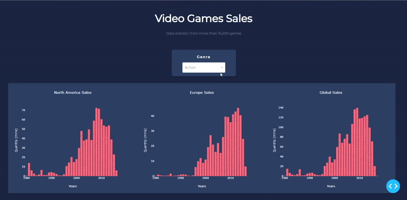

# DashStat

:bar_chart: Web app generates visual statistics from csv file according to selected filters

The application works on Flask framework in conjunction with Python, [Dash](https://dash.plotly.com/), HTML, CSS. 

Modules: 

- Dash modules, for creating charts:
  * dash
  * dash_core_components as dcc
  * dash_html_components as html

- Pandas for working with data from file:
  * pandas as pd

